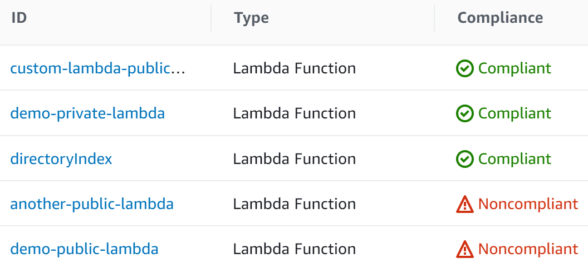

### cf-lambda-public-url-prohibited
Detect publicly accessible Lambda Function URLs in your AWS account.

This CloudFormation template creates an AWS config rule that records public AWS Lambda Function URLs as NON_COMPLIANT.

### Quickstart
1. Enable AWS Config (required).
2. Upload the CloudFormation template.
3. Evaluate the results of the newly created AWS Config Rule.

### Why?
Amazon recently announced [Lambda Function URLs](https://aws.amazon.com/blogs/aws/announcing-aws-lambda-function-urls-built-in-https-endpoints-for-single-function-microservices/) which is a quick way to expose your lambda functions to the internet via an https endpoint.

The problem is AWS didn't update their existing [lambda-function-public-access-prohibited](https://docs.aws.amazon.com/config/latest/developerguide/lambda-function-public-access-prohibited.html) rule that detects publicly accessible Lambdas.

I do anticipate that AWS will update their rule or provide a new rule eventually, but in the meantime this is a blindspot.

### Resources created
- Config Rule
- Lambda Function
- Lambda IAM Role & Policy
- (optional) Demo Lambda Functions

### Boring bits
Below is the default policy created when you enable a public URL for a lambda function.
```json
{
    "Version": "2012-10-17",
    "Id": "default",
    "Statement": [
        {
            "Sid": "FunctionURLAllowPublicAccess",
            "Effect": "Allow",
            "Principal": "*",
            "Action": "lambda:InvokeFunctionUrl",
            "Resource": "arn:aws:lambda:region:accountId:function:functionName",
            "Condition": {
                "StringEquals": {
                    "lambda:FunctionUrlAuthType": "NONE"
                }
            }
        }
    ]
}
```

This custom AWS config rule specifically looks for the `lambda:FunctionUrlAuthType` condition.
```python
def is_public_policy(policy):
    policy = json.loads(policy)
    for rule in policy['Statement']:
        try:
            if rule['Condition']['StringEquals']['lambda:FunctionUrlAuthType'] == 'NONE':
                return True # NON_COMPLIANT
        except KeyError:
            continue
    return False # COMPLIANT
```

